# BlueDot AI Alignment Introduction Project

I undertook this project as part of the [BlueDot](https://bluedot.org/) [AI Safety Fundamentals](https://aisafetyfundamentals.com/) - AI Alignment Course.

## Aims
My aim during this project was to teach myself the basics of Mechanistic Interpretability. To this end, I recreated the code for a recent paper, _Progress Measures for Grokking via Mechanistic Interpretability_, by Neel Nanda et al (https://doi.org/10.48550/arXiv.2301.05217). The paper also has a [great walkthrough video](https://www.youtube.com/watch?v=ob4vuiqG2Go&list=PL7m7hLIqA0hqsReJ0NYhyN3xiFQW9ko1h&index=1), and code examples in the form of a [Google Colab](https://colab.research.google.com/github/neelnanda-io/TransformerLens/blob/main/demos/Grokking_Demo.ipynb) making it an excellent learning resource. 
_(Please note, this project is mainly for my own learning and not intended as a teaching resource)_

The paper in question trains a simple transformer network to do base 113 modular arithmetic. The goal of the exercise is to understand how the networks implements the algorithm. 

In this document, I'll detail the explanation. This will mostly be my rewording of the original paper and resources. I aim to make this as accessible as possible. I will also add my own thoughts and commentary. 

In summary the objectives are: 
1. Train a transformer to do base 113 modular arithmetic. I'll use snippets from the provided Colab in places but I want to write and structure the code to be clean and readable. 
2. Learn the basics of the TransformerLens Python library
3. Use TransformerLens to inspect the weights and activations for different inputs of the network. 
4. Infer from that data how the network is implementing the algorithm

## Motivations
Why do we care? Transformers are the basic building blocks for models like GPT. Understanding how and why they produce the results could be hugely useful for AI Safety. Understanding what different parts of the model do could allow us to delete harmful information from the model eliminating "jailbreaking", detect when a model is uncertain, or detect sycophantic or subversive answers. 

Why base 113 modular arithmetic? It's a simple enough problem that even a tiny transformer can implement it (I'll show later that the model doesn't even use its full capacity). This makes studying the problem tractable. 

## Setup

The model is structured like this (the diagram flows from bottom-to-top):

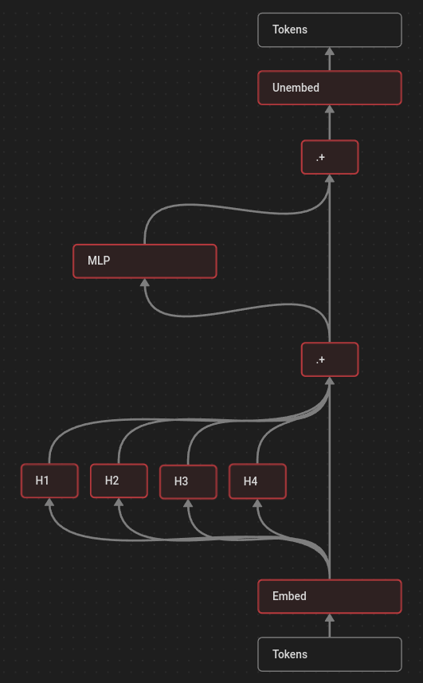

This figure shows a more detailed view, including all the matrices and how they are multiplied together. Matrices are shown in blue boxes. Dimensions in white. 

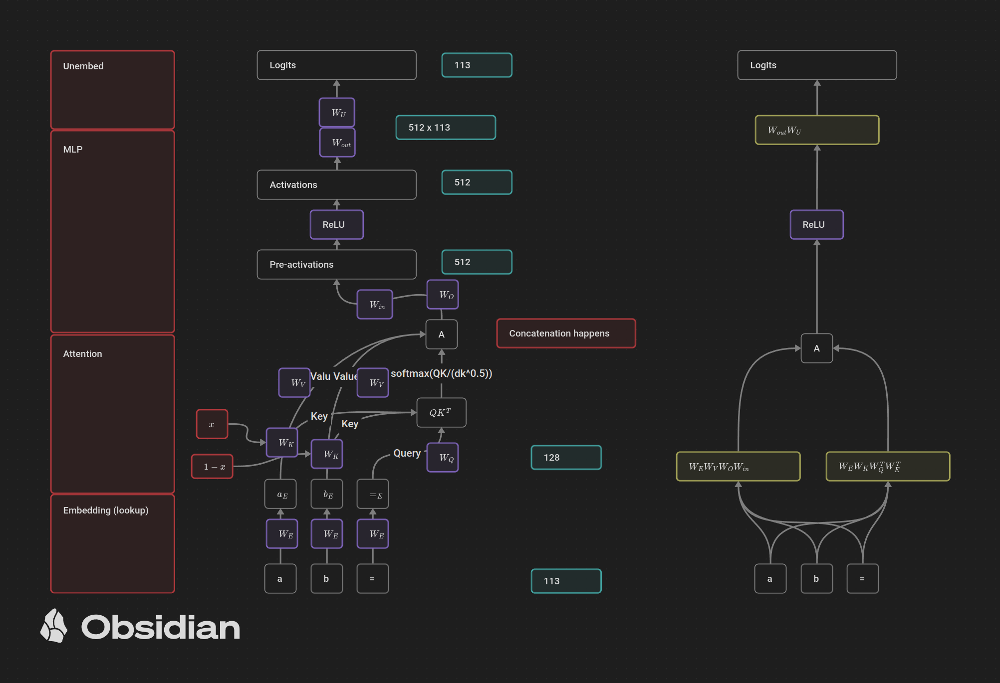

The boxes on the left-hand side represent the main blocks of the model. The middle shows the details of the model. The right-hand side is a simplified version made by combining all the matrix multiplication. For now, we'll focus on the middle.

There are three inputs to the model: the two numbers represented by "a" and "b" and the "=" sign. These can be seen at the bottom. The numbers are represented by "one-hot" vectors. So  "2" would be "[0, 1, 0, ..., 0, 0]. The dataset used to train the model is simply every possible combination of two numbers between 0 and 112 and the labels are the modular sum. I generate all of this in the same way as the paper in [src/task.py](./src/task.py).

The output is a single 113 1D vector of logits. The element with the highest value is the answer, so 1 + 1 might look like [ 0.00232, 0.9812, 0.0001, ...]. 

The model has one transformer layer with 4 attention heads. It's defined in [src/model.py](./src/model.py). Some things to note are the model is a HookedTransformer from the TransformerLens library. This allows us to access the internal weights at each stage easily, and to cache activations (i.e. see what each neuron output for a given input to the model). Also, normalization is turned off to simplify the problem as per the paper. 

Going back to the right-hand view, the key takeaway from this diagram is that much of the complexity shown in the middle column can be simplified. Modular arithmetic is a non-linear operation. Matrices represent linear transformations, and multiplying matrices simply combines them into another linear operation. As such, the two sections it will be worth focusing on are the attention mechanism, and the MLP (with non-linear RELU activation function).

## Training the Model

My code to train the model is in [notebooks/train.ipynb](./notebooks/train.ipynb), so it could be run on Google Colab to make use of their GPUs. It saves the model to the Colab session, I then downloaded the saved model to the [persist](./persist/) folder and loaded it for each analysis. 

The below figure shows the training and test losses for the model. It's trying to make the loss as small as possible. The "train" line is when we evaluate loss on only the examples we show it in training, the "test" line is when it's evaluated on examples it never sees during training. 

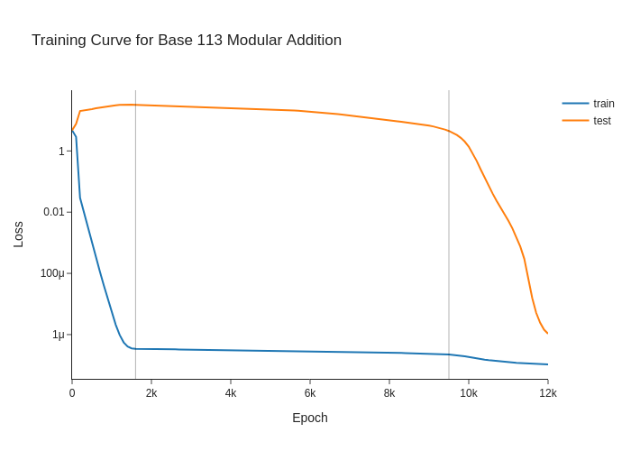

We can see three regions to this graph, I've added vertical lines to separate them. In the left-most, the model learns to memorize the training data. In the right-most it figures out the algorithm and begins to be able to generalize to the unseen cases in the test data. It's worth noting the y-axis is a log scale which somewhat hides the fact the model does make progress towards the general solution in the middle region; there is a slope that is being flattened by the log scale. This graph shows the model is "grokking" where an emergent ability appears if we train it for long enough. Note, the model I train here uses the same parameters as the paper, and they were chosen to make the model grok on this simple task. In larger models like GPT3/4 we see this with abilities like spatial reasoning. (This corresponds to section 5.2 of the original paper).

## Analysis

The code for this section is in [basic_analysis.py](basic_analysis.py) and [fourier_analysis.py](basic_analysis.py)

### Embeddings

Starting from the inputs, I first use Singular Value Decomposition (as simple as calling `torch.linalg.svd()`) on the embedding matrix. This is the 113 x 128 matrix the 113 dimension one-hot vector is multiplied by to give us the 128 input to the transformer attention block. The one-hot vector essentially "looks up" a row in the embedding vector. 

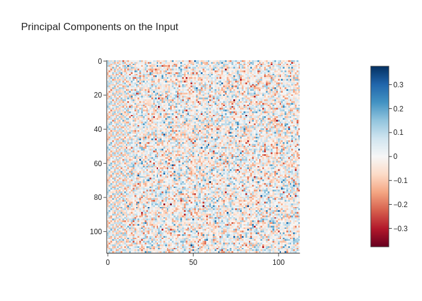 

From examining the principal components, it appears that most resemble random noise, but there's some structure to the first few components shown on the left. 

Looking at the singular values, this is confirmed, the first 8-10 dimensions appears to be more important than the rest. 

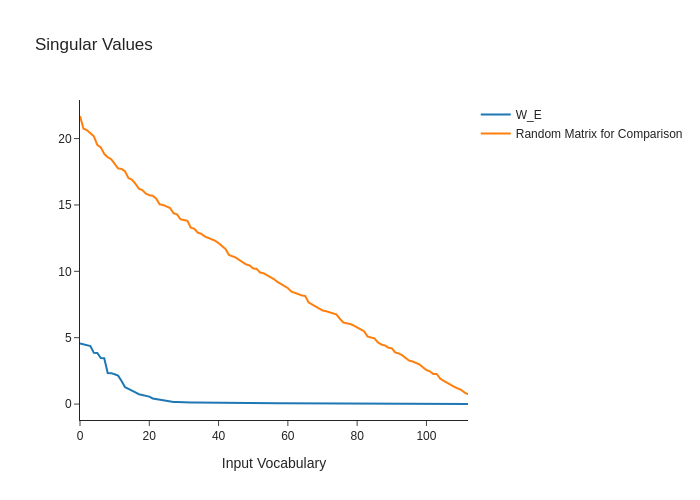

Zooming in on those components reveals the first clue. 

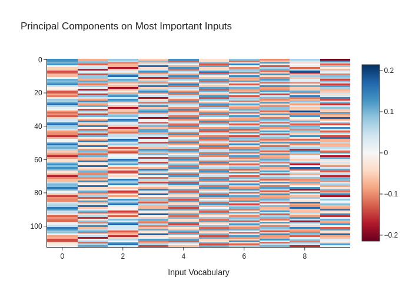

They appear highly periodic. 

In summary, the network has learned an embedding matrix during training that converts the one-hot representation of the inputs a and b to a 128 dim vector. Of that vector, it seems to only use the first 8-10 dimensions, and each of those dimensions appears to be a repeating pattern. 

Given we have a periodic pattern, a natural tool for examining it is Fourier analysis. The core idea behind it is that any wave can be represented by adding sin waves of different frequencies together. In the paper and walkthrough, they make a "Fourier basis" matrix and do this by hand. For those (like me) not as familiar with the maths of how it works, libraries like `scipy` make doing an analysis very simple 

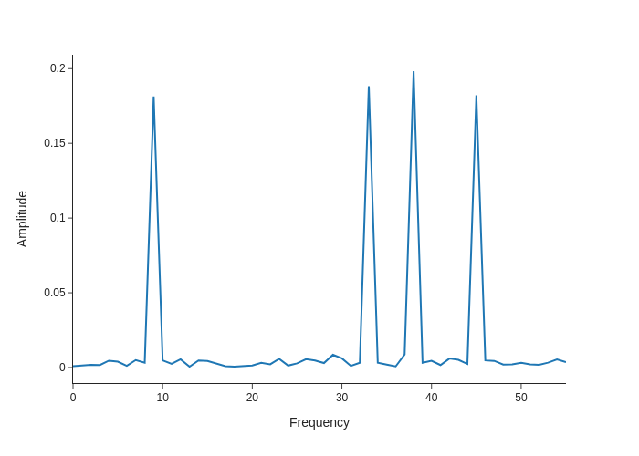

This graph shows that the repeating patterns seen in the embedding matrix are made up of sin waves of only 4 frequencies. 

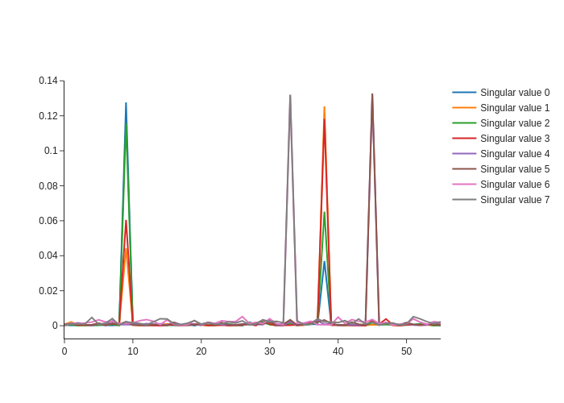

Going further and plotting each dimension independently shows some are "pure" (just a sin wave of a single frequency) and some are mixed. 

In the walkthrough, the authors create a "Fourier basis" matrix. 

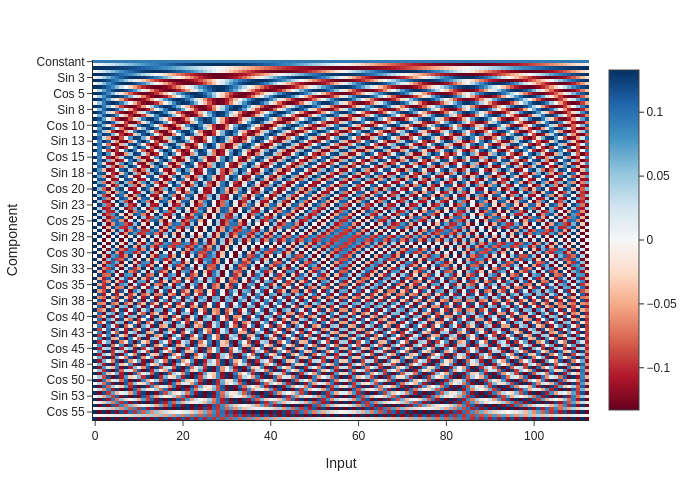

The rows of this matrix are pairs of sin and cos waves at increasing frequencies. (It also looks really pretty). 
We can pre-multiply this matrix with matrices from our model, to do the Fourier analysis.

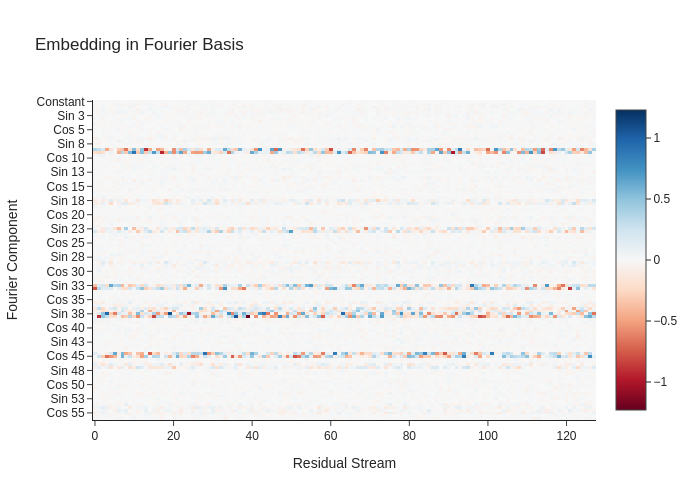   

The rows corresponding to the same key frequencies seen from the `scipy` Fourier analysis show up. 

### Attention Heads

The TransformerLens library allows us to cache values from points throughout the model for every combination of inputs, a and b (every possible combination of two numbers from 0 to 112). 

We can use this to look at the next step of the model, the attention heads. 

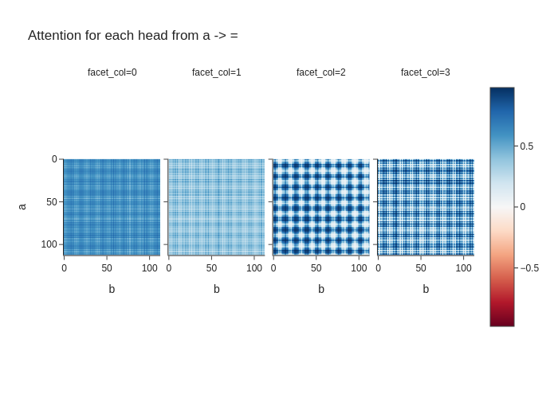

Here too, we see the highly periodic pattern. Looking at just the first head:

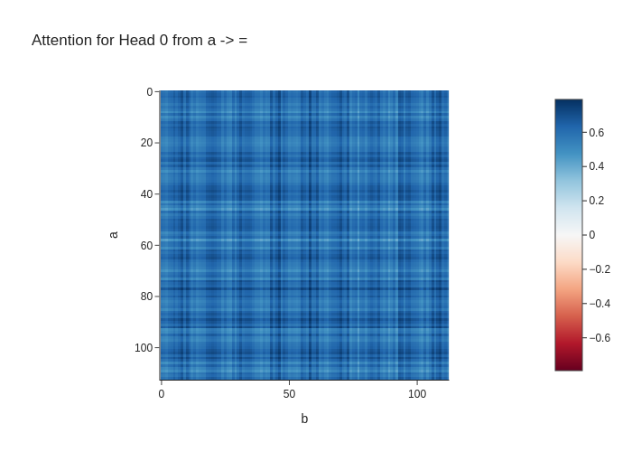

This is showing us how the "importance" of the value of "a" (as determined by the first head of 4) varied for all combinations of "a" and "b". 

### Neuron Activations

Looking at the first 5 of the 512 neurons in the MLP layer, we see more of the periodic patterns. 

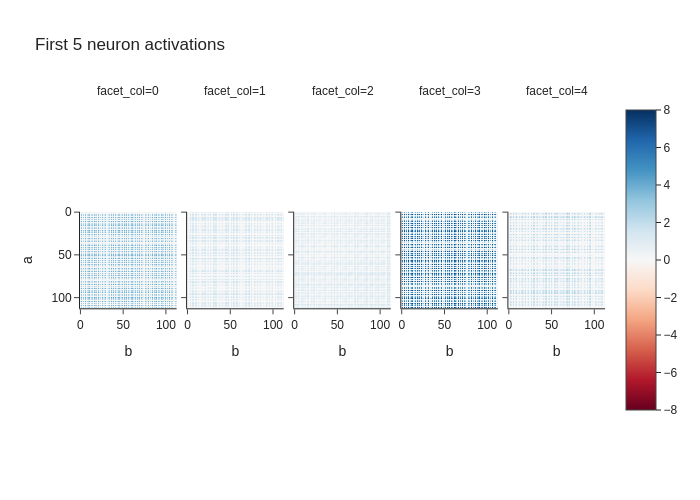

Using the same Fourier basis matrix, we can do a 2D Fourier analysis of the neuron activations: 

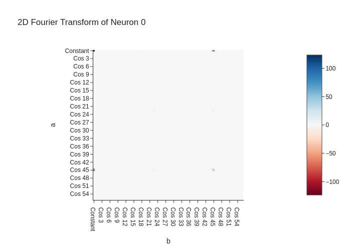

We can see that this neuron's activations correspond to combinations of sin(ωa) cos(ωa) where ω 45, one of the key frequencies we identified earlier. 

## Putting it all together
These analyses show us how the network is doing the modular arithmetic. 
1. The embedding matrix converts the one-hot vectors into the form of sin(ωa),cos(ωa),sin(ωb),cos(ωb) for 4 key frequencies ω
2. The attention and MLP layers combine those sin and cos waves. The combination is equivalent to a trig identity sin(ωa)cos(ωb)+cos(ωa)sin(ωb) -> sin(ω(a+b)), i.e. the whole operation is equivalent to adding the angles a and b together as angles. 
3. Then unembedd operation uses another trig identity to produce the output 113 dim vector. Each element is equivalent to the cos(ω(a+b-c)) where c is the index fo that element. As such, they range between -1 and 1 

## Improvements I would make with more time
I'd attempt to show how the model is doing the trig identities in more detail. The paper does this in 4.2, but I'd love to find a more graphical way to show that's what's happening. 

## Reflections
This project gave me an appreciation for the challenge of Mechanistic Interpretability. This was an extremely simple toy problem, and the simplest model possible. It has 1 layer, complicating features like layer norms were turned off, it had small dimensions. Picking apart how it was implementing the task was a time-consuming process even with the walkthrough. The approach of using frequency (Fourier) analysis was based upon observing patterns in the model's matrices. That's not something we can do with 7 billion parameter models. Furthermore, the method of frequency analysis is specific to _this_ problem, it only works because modular arithmetic can be viewed as "clock" arithmetic, going around on a circle. Additionally, this challenge was simple enough that the model had excess parameters (see the section on the embeddings, using only 8 of the 128 available dimensions). When this isn't the case (as with large language models), they 